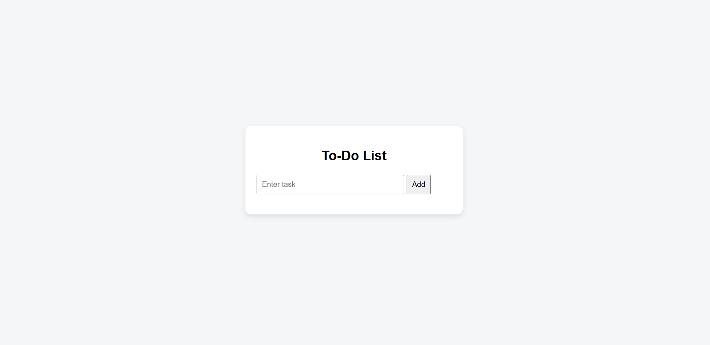

# todo-list-javascript
To-Do List Web App using HTML, CSS, JavaScript
# 📝 To-Do List Web App

Project Overview:
This project is a simple To-Do List Web Application that helps users manage their daily tasks efficiently. Users can add, delete, and mark tasks as completed.

Features:
Add new tasks
Delete tasks
Mark tasks as completed
Tasks stored using Local Storage
Simple and user-friendly interface

Technologies Used:
HTML
CSS
JavaScript (DOM Manipulation)
Browser Local Storage

Requirements:
Web browser (Chrome, Edge, Firefox, etc.)
No additional installation required

🚀 How to Run:
Download or clone the repository
Open index.html in any browser

🎯 Output:
Add and manage tasks easily
Tasks remain saved even after refresh
Interactive task management (add/delete/complete)
Clean and responsive UI

🌐 Live Demo:
https://himesh-tech.github.io/todo-list-javascript/

